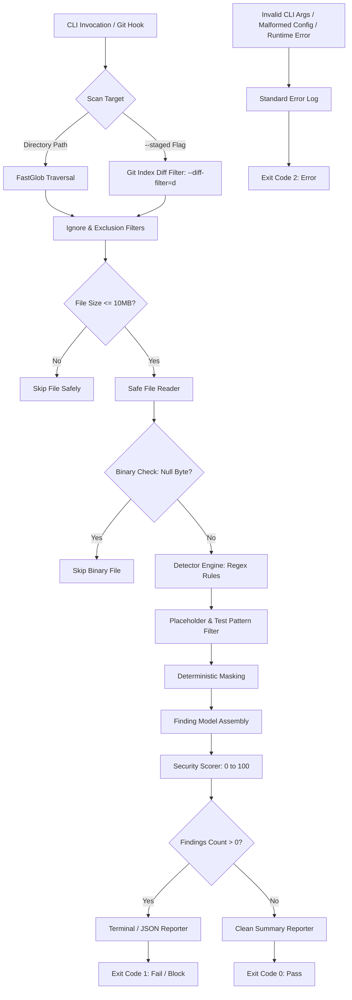

# GitLeak Radar 🛡️

[](https://github.com/gecekusu1979/gitleak-radar/actions)
[](LICENSE)
[](https://www.typescriptlang.org/)
[](https://nodejs.org/)
[-success.svg)](#security-model)

> **Static credential scanner and automated Git pre-commit hook designed to detect exposed API keys, access tokens, private keys, and database connection strings before code is committed or pushed.**

GitLeak Radar runs locally across your codebase or directly against the staged Git index. It uses regex-based pattern matching, filters out common false-positive placeholders, masks matched secrets in memory, computes a 0–100 repository security score, and enforces workflow gates using standard UNIX exit codes.

---

## Key Features

- **Leak-Safe Finding Contract:** Plaintext secrets are excluded from the core `Finding` data model. Terminal and JSON reporters exclusively expose masked fingerprints (e.g., `AKIA********1234`).
- **Staged Git Scanning:** Scans changes directly in the Git staging index via `git diff --cached`, correctly resolving files across repository root and nested working directories.
- **Pre-commit Automation:** Idempotent hook installer (`gitleak-radar install-hook`) that verifies staged files and halts commits when credentials are found.
- **Large File Protection:** Skips files larger than 10MB (`MAX_FILE_SIZE_BYTES`) before buffering into memory to prevent process exhaustion.
- **Binary & Ignore Handling:** Automatically bypasses null-byte binary buffers, `.git`, `node_modules`, `dist`, `build`, and lockfiles.
- **Configurable Rules & Paths:** Optional `.gitleak-radar.json` schema validated with Zod to ignore custom patterns or toggle specific detectors.
- **Machine-Readable JSON:** Standardized JSON reporter (`--json`) designed for CI/CD log collection and custom pipeline reporting.
- **Deterministic Exit Codes:** Strict exit code convention (`0`, `1`, `2`) for pipeline and shell integration.

## Architecture

The following diagram illustrates the execution path from CLI entry to exit code assignment:



## Quick Start

### Installation

Install globally using `npm` or `pnpm`:

```bash
npm install -g gitleak-radar
# or
pnpm add -g gitleak-radar
```

Alternatively, invoke directly with `npx`:

```bash
npx gitleak-radar scan .
```

### Basic Scans

Scan the entire current directory:

```bash
gitleak-radar scan .
```

Scan only files currently in the Git staging area:

```bash
gitleak-radar scan --staged
```

## Pre-commit Hook Integration

Install GitLeak Radar into your local `.git/hooks/pre-commit` file:

```bash
gitleak-radar install-hook
```

The installer verifies whether the hook script is already registered before writing, making the setup safe to re-run.

Once configured, any commit containing matching secrets is automatically intercepted and aborted:

```bash
git add .
git commit -m "feat: add payment gateway credentials"

# Scanning for secrets...
# ✖ AWS Access Key ID detected in src/config.ts:14
# Commit blocked. Exit code 1.
```

## CLI Reference

```text
Usage: gitleak-radar [options] [command]

GitLeak Radar - Fast, local source-code secret scanner CLI.

Options:
  -V, --version                      Output the current version
  -h, --help                         Display help for command

Commands:
  scan [options] [path]              Scan files or staged Git changes for secrets
  rules                              List all built-in credential detection rules
  install-hook [path]                Install GitLeak Radar as a Git pre-commit hook
```

### Scan Command Options

```bash
# Scan with specific severity threshold (low, medium, high, critical)
gitleak-radar scan . --severity high

# Emit raw, automation-ready JSON output
gitleak-radar scan . --json

# Enable verbose logging to see scanned, ignored, and binary files
gitleak-radar scan . --verbose

# Ignore specific directories during a filesystem scan
gitleak-radar scan . --ignore "fixtures" "temp-data"

# Inspect detailed command help
gitleak-radar scan --help
```

## Detection Rules

All rules are defined in `src/detectors/rules.ts` and can be inspected with `gitleak-radar rules`:

| Rule ID | Severity | Target Credential Type | Description / Matching Pattern |
| --- | --- | --- | --- |
| `aws-access-key` | `CRITICAL` | AWS Access Key ID | 20-character identifier starting with `AKIA` |
| `aws-secret-key` | `CRITICAL` | AWS Secret Access Key | 40-character secret patterns bound to AWS key variables |
| `github-pat` | `CRITICAL` | GitHub Personal Access Token | Modern prefixed tokens (`ghp_`, `gho_`, `ghu_`, `ghs_`, `ghr_`) |
| `jwt` | `HIGH` | JSON Web Token | Three-segment Base64URL-encoded tokens (`ey...`) |
| `postgres-uri` | `HIGH` | PostgreSQL Connection URI | Standard connection strings (`postgres://` / `postgresql://`) |
| `mongo-uri` | `HIGH` | MongoDB Connection URI | MongoDB URIs (`mongodb://` / `mongodb+srv://`) |
| `private-key` | `CRITICAL` | Private Key Block | PEM private key boundaries (`-----BEGIN ... PRIVATE KEY-----`) |
| `generic-api-key` | `MEDIUM` | Generic API Secret | Common token, API key, password, and secret variable assignments |

## Configuration (`.gitleak-radar.json`)

To configure custom path exclusions or disable specific rules, add an optional `.gitleak-radar.json` file to the root of your project:

```json
{
  "ignore": [
    "fixtures/**",
    "docs/**"
  ],
  "rules": {
    "generic-api-key": false
  }
}
```

### Schema Rules & Error Handling

- **`ignore`**: Array of glob path strings to skip during directory scans.
- **`rules`**: Key-value map of rule IDs to booleans. Set a rule to `false` to disable it.
- **Validation**: Configurations are strictly validated using a Zod schema. If the JSON is malformed or invalid, GitLeak Radar aborts execution with exit code `2`.

## Security Model

- **Safe Process Invocation:** All Git commands (`rev-parse`, `diff`) run through `child_process.execFile` with isolated argument arrays. Shell string concatenation is not used, preventing command injection.
- **Fingerprinting Only:** The `Finding` interface does not contain a raw secret field. Reporters receive masked representations instead of plaintext credentials.
- **Pre-read Size Guard:** File size is verified via filesystem metadata (`fs.stat`) prior to reading contents into memory, safely skipping buffers larger than 10MB.
- **Zero Network Interaction:** GitLeak Radar contains no network dependencies, telemetry emitters, or cloud connections. Scanning logic executes entirely on the local host.

## Exit Codes

GitLeak Radar follows POSIX exit conventions for standard shell and CI/CD integration:

| Exit Code | Status | Description |
| --- | --- | --- |
| `0` | Clean | Scan completed successfully with zero findings above the selected severity. |
| `1` | Findings Detected | One or more active secrets matching the criteria were detected. |
| `2` | Execution Error | Scan aborted due to invalid arguments, malformed JSON configuration, or runtime failures. |

## Repository Structure

```text
src/
├── cli/              # Commander CLI entrypoint, argument parsing, error routing
├── config/           # Zod schema validation and .gitleak-radar.json loading
├── detectors/        # Regex pattern matching rules and secret detector logic
├── git/              # Git root resolution and staged diff filtering
├── hooks/            # Idempotent Git pre-commit hook installer
├── reporters/        # Chalk terminal and JSON report formatters
├── scanner/          # File filtering, 10MB size guard, and orchestrator pipeline
├── scoring/          # 0-100 normalized security score algorithm
└── types/            # TypeScript interfaces (Finding, ScanResult, ScanOptions)

tests/
├── cli/              # CLI integration and argument tests
├── config/           # Zod validation and invalid configuration tests
├── detectors/        # Pattern detection and false-positive filter tests
├── git/              # Git root resolution and staged diff tests
├── scanner/          # File exclusion, binary, and 10MB limit tests
└── scoring/          # Security score calculation tests
```

## Development & Testing

### Requirements

- Node.js >= 18.0.0
- pnpm >= 9.0.0

### Commands

```bash
# Install local dependencies
pnpm install

# Run TypeScript typechecks
pnpm typecheck

# Run the Vitest test suite
pnpm test

# Build the production bundle
pnpm build

# Test package artifacts without publishing
npm pack --dry-run
```

## Why GitLeak Radar?

- **Local-First Architecture:** Keeps credential evaluation directly inside your machine or ephemeral CI worker.
- **Native Git Integration:** Inspects Git index buffers rather than scanning the entire filesystem on every commit.
- **Commit Gatekeeper:** Blocks secrets before they enter your commit history, avoiding complex Git history rewrites.
- **Type-Safe Core:** Built with strict TypeScript checks and validated configuration schemas.

## Roadmap

The following capabilities are planned for upcoming releases:

- [ ] Shannon entropy analysis to supplement regex heuristics
- [ ] SARIF reporter support for native GitHub Code Scanning integration
- [ ] Configurable maximum file size limits via CLI and `.gitleak-radar.json`
- [ ] Custom user-defined regex rules in configuration

## License

This project is licensed under the **GNU General Public License v3.0** (GPL-3.0-or-later). See the [LICENSE](LICENSE) file for the full license text.
