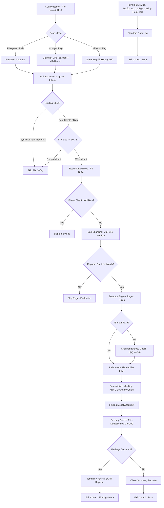

# GitLeak Radar

[](https://www.npmjs.com/package/gitleak-radar)
[](https://www.npmjs.com/package/gitleak-radar)

[](https://github.com/gecekusu1979/gitleak-radar/actions)
[](https://github.com/gecekusu1979/gitleak-radar)
[]()
[](LICENSE)
[](https://www.typescriptlang.org/)
[](https://nodejs.org/)
[-success.svg)](#security-model)

> **Enterprise-grade, local-first source code secret scanner and automated Git pre-commit gate designed to intercept exposed API keys, access tokens, private keys, and database credentials before they reach version control or CI/CD pipelines.**

GitLeak Radar runs locally across your codebase, directly against the staged Git index, across Git commit history, or incrementally on PR branch diffs. It combines regex pattern matching, keyword pre-filtering, character-set-aware Shannon entropy calculation, fail-closed pre-commit hooks, and multi-format reporting while preserving masked findings and a 0-100 repository security score.

GitLeak Radar is designed as a local-first SAST tool for detecting API keys, access tokens, private keys, database credentials, and other sensitive values before they enter commits or CI/CD workflows.

---

## Key Features

- **Shannon Entropy Engine:** Generic API key candidates are validated with Shannon entropy and a default threshold of $H(X) \ge 3.0$ to reduce low-complexity false positives.
- **Streaming Git History Scanning:** `--history` processes added diff lines incrementally instead of loading the complete commit history into memory, while retaining commit hash, author, and date metadata for findings.
- **History Diff Hardening:** History scans force `diff.external=` and `--no-ext-diff`, and terminate Git path arguments with `--` to reduce external diff and argument-injection risks.
- **SARIF v2.1.0 Reporting:** `--sarif [file]` emits OASIS SARIF 2.1.0 output for GitHub Code Scanning and other compatible CI tooling.
- **Multi-Format Enterprise Reporting:** JUnit XML (`--junit`), GitLab Code Quality (`--gitlab`), and native GitHub Actions annotations (`--github-actions`) complement SARIF output.
- **Incremental PR Scanning:** `--since <ref>` scans files changed since a commit, branch, or tag, including newly added untracked files.
- **Baseline / Allowlist Management:** `--create-baseline` snapshots known findings and `--baseline` suppresses them in future scans using SHA-256 fingerprints.
- **Recursive Decoding:** Bounded two-layer URL, Base64/Base64URL, and hexadecimal decoding catches secrets hidden behind common encoding steps without unbounded processing.
- **Fingerprint Allowlisting:** Exact values or SHA-256 fingerprints can be allowlisted through `.gitleak-radar.json` or `--allowlist`; fingerprints avoid storing secret material in configuration.
- **Inline False-Positive Suppression:** `// gitleak-radar:ignore` and `// gitleak-radar:ignore-next-line` can suppress all rules or selected rule IDs.
- **Rule Explainer:** `gitleak-radar explain <rule-id>` displays pattern details, risk context, and remediation guidance.
- **Configurable File Size Limits:** `--max-file-size` accepts byte values and human-readable units such as `5MB` and `500KB` across filesystem, staged, and history scans.
- **True Git Index Isolation:** In `--staged` mode, files are evaluated directly from Git's object database (`git show :<path>`). Modifying or clearing a secret from the working directory after staging cannot bypass detection.
- **Fail-Closed Pre-Commit Security:** Hook scripts enforce a fail-closed posture (`exit 2`). If `gitleak-radar` or `npx` cannot be executed, commits are blocked rather than silently skipped.
- **Monorepo & Nested Config Traversal:** `.gitleak-radar.json` configurations are resolved through upward filesystem traversal from the target path.
- **High-Performance Keyword Pre-Filtering:** Fast substring pre-screening via `rule.keywords` eliminates unnecessary regex evaluations on unrelated lines.
- **Leak-Safe Finding Contract:** Plaintext secrets are excluded from the core `Finding` data model. Terminal and JSON reporters exclusively expose masked fingerprints (e.g., `AKIA********1234`).
- **Self-Security Hardening:** Hardened against ReDoS on minified bundles (`MAX_LINE_LENGTH = 8192`), symlink traversal exploits (`fs.lstat` and Git mode `120000`), and Git CLI argument injection (`--` option delimiters).
- **Isolated Custom Regex Evaluation:** Custom rules are evaluated in time-limited worker threads to contain catastrophic backtracking; invalid or timed-out rules fail safely.
- **Default Test Directory Coverage:** `tests/` and `test/` directories are scanned by default to prevent hardcoded credentials from leaking through test fixtures or mock environments.
- **Unquoted `.env` Secret Detection:** Robust capture rules support both quoted and unquoted environment variable definitions (e.g., `API_KEY=sk_live_...`), preserving comments and boundary safety.
- **Path-Aware Placeholder Filtering:** Distinct placeholder logic ensures real credentials containing words like `test` or `dummy` (e.g., `sk_test_...`) in production code are never filtered out, while documentation and fixtures retain test-token bypasses.
- **Coordinate-Based Security Scoring:** Deduplicates findings on the exact same physical coordinates (file, line, column) to the highest severity, while distinct secrets across different lines apply cumulative penalties for accurate risk assessment.
- **Staged Git Scanning:** Scans changes directly in the Git staging index via `git diff --cached`, correctly resolving files across repository root and nested working directories.
- **Pre-commit Automation with Severity Control:** Hook installer (`gitleak-radar install-hook -s <level>`) configures automated commit validation with explicit POSIX executable permissions and customizable threshold gating.
- **Large File Protection:** Skips files larger than 10MB (`MAX_FILE_SIZE_BYTES`) before buffering into memory to prevent process exhaustion.
- **Binary & Ignore Handling:** Automatically bypasses null-byte binary buffers, `.git`, `node_modules`, `dist`, `build`, and lockfiles. User files named `rules.ts` or `detector.ts` outside internal engine directories are fully scanned.
- **Strict Config Validation:** `.gitleak-radar.json` configurations are verified with Zod for known rule IDs and checked against malformed glob syntax.
- **Deterministic Exit Codes:** Strict exit code conventions (`0`, `1`, `2`) for robust pipeline and shell automation.

## Advanced Security Features

### Shannon Entropy Engine

For entropy-aware rules, GitLeak Radar calculates the character distribution of each candidate token:

$$H(X) = -\sum_{i=1}^{n} P(x_i) \log_2 P(x_i)$$

Candidates below the configured threshold are discarded as low-complexity values. The built-in `generic-api-key` rule uses a minimum entropy threshold of $H(X) \ge 3.0$.

### Streaming Git History

`gitleak-radar scan --history` reads Git diff output incrementally, scanning added lines while retaining commit hash, author, and ISO date metadata. History scans disable external diff commands with `-c diff.external=` and `--no-ext-diff`, and use `--` to isolate Git path arguments.

### SARIF Integration

`gitleak-radar scan --sarif report.sarif` writes SARIF v2.1.0 output with rule metadata, source locations, severity levels, masked messages, and commit fingerprints where available. Omitting the file path writes the report to standard output for CI pipelines.

### Additional CI Reporters

```bash
# JUnit XML for Jenkins, Azure DevOps, and Bitbucket
gitleak-radar scan . --junit junit.xml

# GitLab Code Quality report
gitleak-radar scan . --gitlab gl-code-quality-report.json

# GitHub Actions inline annotations
gitleak-radar scan . --github-actions
```

JUnit and GitLab reports accept an optional output path; when omitted, they are written to standard output. Findings remain masked in every output format.

### Incremental Scans and Baselines

Scan only files changed relative to a Git ref, which is useful for pull-request checks:

```bash
gitleak-radar scan --since origin/main --github-actions
```

To adopt GitLeak Radar in a legacy repository without failing on existing findings:

```bash
gitleak-radar scan --create-baseline
gitleak-radar scan --baseline .gitleak-radar-baseline.json
```

Baseline entries use SHA-256 fingerprints based on finding coordinates and rule identity. Newly introduced findings continue to fail the scan.

## GitHub Action

Use the composite action from a tagged release. Pinning the tag or commit is
recommended for reproducible CI. The action release and the npm scanner
release is synchronized at `v1.5.0`; the action runs the reviewed
`gitleak-radar@1.5.0` package by default.

```yaml
permissions:
  contents: read
  security-events: write

steps:
  - uses: actions/checkout@v7
    with:
      fetch-depth: 0
  - name: Scan for secrets
    uses: gecekusu1979/gitleak-radar@v1.5.0
    with:
      version: '1.5.0'
      upload-sarif: true
      upload-artifact: true
      fail-on-findings: true
      pr-comment: false
```

The action passes inputs to the scanner as process arguments rather than
shell-expanded source code. Optional PR comments require a token and should
only be enabled in workflows where the token has the minimum required
permissions. See [SECURITY.md](SECURITY.md) before using the action with
untrusted pull requests.

After each scan, the action writes a masked, secret-free summary to the
workflow's **Actions job summary**. It includes the result count and the first
10 finding locations without exposing matched secret values. The complete
structured report remains available in the generated SARIF file and, when
enabled, the GitHub Security tab.

SARIF files and workflow artifacts can contain repository-relative file paths,
rule identifiers, and finding locations. Treat uploaded artifacts as sensitive
CI output and restrict workflow permissions and artifact access accordingly.

The Marketplace action runs on Node.js 24 and installs the exact scanner
version with npm lifecycle scripts disabled. This keeps the action aligned with
GitHub's current Actions runtime and reduces supply-chain execution surface
during installation.

| Input | Default | Purpose |
| --- | --- | --- |
| `path` | `.` | Directory to scan |
| `version` | `1.5.0` | Exact npm scanner version |
| `severity` | `low` | Minimum finding severity |
| `since` | empty | Scan changes since a Git ref |
| `staged` | `false` | Scan staged Git index files |
| `history` | `false` | Scan Git commit history |
| `baseline` | empty | Suppress accepted findings |
| `rules` | empty | Custom rules JSON path |
| `upload-sarif` | `true` | Upload SARIF to GitHub Security |
| `upload-artifact` | `false` | Preserve SARIF as a workflow artifact |
| `artifact-name` | `gitleak-radar-results` | Name of the SARIF artifact |
| `fail-on-findings` | `true` | Fail when findings are detected |
| `pr-comment` | `false` | Add a PR summary comment |

Use `fetch-depth: 0` when enabling `history: true` or scanning changes against
a remote base ref. This makes the required Git commits available to the scan.

For high-assurance workflows, replace the release tag with the reviewed commit
SHA after verifying the release contents:

```yaml
uses: gecekusu1979/gitleak-radar@<reviewed-commit-sha>
```

### Inline Ignore Directives

Suppress a finding on the same line or on the following line. A rule ID may be supplied to keep the suppression narrow:

```typescript
// gitleak-radar:ignore-next-line
const mockToken = "sk_live_" + "abcdef1234567890abcdef1234";

const sampleKey = "AKIA1234567890EXAMPLE"; // gitleak-radar:ignore aws-access-key
```

## Performance

The scanner is optimized for local and CI use through keyword pre-filtering, bounded 8 KB line processing, file-size guards, and streaming history parsing. Run `pnpm test` to measure the current test-suite duration in your environment.

## Architecture

The following diagram illustrates the execution path from CLI entry to exit code assignment:



## Quick Start

### Installation

Install globally using `npm` or `pnpm`:

```bash
npm install -g gitleak-radar
# or
pnpm add -g gitleak-radar
```

Alternatively, invoke directly with `npx`:

```bash
npx gitleak-radar scan .
```

### Basic Scans

Initialize default configuration:

```bash
# Initialize default configuration
npx gitleak-radar init
```

Scan the entire current directory:

```bash
gitleak-radar scan .
```

Scan only files currently in the Git staging area:

```bash
gitleak-radar scan --staged
```

Scan added lines across the full Git commit history:

```bash
gitleak-radar scan --history
```

Generate a SARIF v2.1.0 report for CI or GitHub Code Scanning:

```bash
gitleak-radar scan --sarif report.sarif
```

## Pre-commit Hook Integration

Install GitLeak Radar into your local `.git/hooks/pre-commit` file:

```bash
gitleak-radar install-hook
```

The installer verifies whether the hook script is already registered before writing, making the setup safe to re-run.

To configure a minimum severity threshold for commits:

```bash
gitleak-radar install-hook -s high
```

### Fail-Closed Behavior

The pre-commit hook runs in **fail-closed mode**: if `gitleak-radar` or `npx` is not available in the execution environment, commits are blocked with exit code `2` to prevent uninspected code from entering version control. Commits can be bypassed explicitly when needed using `git commit --no-verify`.

```bash
git add .
git commit -m "feat: add payment gateway credentials"

# GitLeak Radar: Scanning staged files...
# Commit blocked: Sensitive credentials detected in staged changes.
# Please unstage or mask secrets before committing.
# Exit code 1.
```

## CLI Reference

```text
Usage: gitleak-radar [options] [command]

GitLeak Radar - Fast, local source-code secret scanner CLI.

Options:
  -V, --version                      Output the current version
  -h, --help                         Display help for command

Commands:
  scan [options] [path]              Scan files or staged Git changes for secrets
  rules                              List all built-in credential detection rules
  init [path]                        Initialize a default .gitleak-radar.json configuration file
  install-hook [options] [path]      Install GitLeak Radar as a Git pre-commit hook
```

### Scan Command Options

| Option | Description | Default |
| --- | --- | --- |
| `-s, --severity <level>` | Minimum severity: `low`, `medium`, `high`, or `critical` | `low` |
| `-i, --ignore <dirs...>` | Additional directory patterns to ignore | - |
| `--allowlist <entries...>` | Suppress exact secret values or SHA-256 fingerprints | - |
| `-r, --rules <file>` | Path to external custom rules JSON file | - |
| `--max-file-size <size>` | Maximum file size, such as `5MB`, `500KB`, or bytes | `10MB` |
| `--baseline <file>` | Suppress findings recorded in a baseline file | - |
| `--create-baseline [file]` | Create a baseline snapshot and exit | `.gitleak-radar-baseline.json` |
| `--staged` | Scan only files in the Git index | - |
| `--history` | Scan added lines across Git commit history | - |
| `--since <ref>` | Scan files changed since a Git ref | - |
| `--json` | Emit machine-readable JSON | - |
| `--sarif [file]` | Emit SARIF v2.1.0 to stdout or a file | - |
| `--junit [file]` | Emit JUnit XML to stdout or a file | - |
| `--gitlab [file]` | Emit GitLab Code Quality JSON to stdout or a file | - |
| `--github-actions` | Emit GitHub Actions workflow annotations | - |
| `-v, --verbose` | Show scanned, ignored, and binary files | - |

```bash
# Scan with specific severity threshold (low, medium, high, critical)
gitleak-radar scan . --severity high

# Emit raw, automation-ready JSON output
gitleak-radar scan . --json

# Enable verbose logging to see scanned, ignored, and binary files
gitleak-radar scan . --verbose

# Ignore specific directories during a filesystem scan
gitleak-radar scan . --ignore "fixtures" "temp-data"

# Suppress known non-sensitive values (or use their SHA-256 fingerprints)
gitleak-radar scan . --allowlist "example-token-value"

# Scan full Git history using a streaming diff parser
gitleak-radar scan . --history

# Write SARIF v2.1.0 output to a file (omit the path to print to stdout)
gitleak-radar scan . --sarif report.sarif

# Scan only changes since the main branch
gitleak-radar scan . --since origin/main --github-actions

# Apply a human-readable file-size limit
gitleak-radar scan . --max-file-size 5MB

# Inspect detailed command help
gitleak-radar scan --help
```

## Detection Rules

All rules are defined in `src/detectors/rules.ts` and can be inspected with `gitleak-radar rules`:

| Rule ID | Severity | Target Credential Type | Description / Matching Pattern |
| --- | --- | --- | --- |
| `aws-access-key` | `CRITICAL` | AWS Access Key ID | 20-character identifier starting with `AKIA` |
| `aws-secret-key` | `CRITICAL` | AWS Secret Access Key | 40-character secret patterns bound to AWS key variables |
| `github-pat` | `CRITICAL` | GitHub Personal Access Token | Modern prefixed tokens (`ghp_`, `gho_`, `ghu_`, `ghs_`, `ghr_`, `github_pat_`) |
| `gitlab-pat` | `CRITICAL` | GitLab Personal Access Token | GitLab personal and project tokens (`glpat-...`) |
| `stripe-api-key` | `CRITICAL` | Stripe API Key | Live standard and restricted keys (`sk_live_`, `rk_live_`) |
| `openai-api-key` | `CRITICAL` | OpenAI API Key | Legacy and project-scoped keys (`sk-`, `sk-proj-`) |
| `slack-webhook` | `HIGH` | Slack Incoming Webhook | Slack webhook URLs (`hooks.slack.com/services/...`) |
| `azure-storage-key` | `CRITICAL` | Azure Storage Account Key | `AccountKey` and `SharedAccessKey` values |
| `jwt` | `HIGH` | JSON Web Token | Three-segment Base64URL-encoded tokens (`ey...`) |
| `db-connection-string` | `HIGH` | Database Connection URI | Embedded credentials in MongoDB, PostgreSQL, and MySQL connection strings |
| `private-key` | `CRITICAL` | Private Key Block | PEM private key boundaries (`-----BEGIN ... PRIVATE KEY-----`) |
| `slack-token` | `HIGH` | Slack Access Token | Slack user, bot, and app tokens (`xox[baprs]-...`) |
| `google-api-key` | `HIGH` | Google API Key | Google Cloud and service keys starting with `AIza` |
| `twilio-api-key` | `CRITICAL` | Twilio API Key | `SK`-prefixed 32-character hexadecimal identifiers |
| `sendgrid-api-key` | `CRITICAL` | SendGrid API Key | Dot-delimited keys starting with `SG.` |
| `npm-token` | `CRITICAL` | npm Access Token | Publish/read tokens starting with `npm_` (supply-chain risk) |
| `pypi-token` | `CRITICAL` | PyPI API Token | Upload tokens starting with `pypi-AgEIcHlwaS5vcmc` (supply-chain risk) |
| `digitalocean-token` | `CRITICAL` | DigitalOcean Personal Access Token | Tokens starting with `dop_v1_` |
| `discord-webhook` | `HIGH` | Discord Webhook | Published `discord.com/api/webhooks/...` URLs |
| `generic-api-key` | `MEDIUM` | Generic API Secret | Quoted or unquoted assignments validated with $H(X) \ge 3.0$ entropy |
| `generic-bearer-token` | `HIGH` | Generic Bearer Token | Bearer authorization tokens (minimum 20 characters) |
| `generic-password` | `MEDIUM` | Generic Password Assignment | Hardcoded passwords in source code or `.env` configurations |

## Configuration (`.gitleak-radar.json`)

To configure path exclusions or toggle specific rules, add an optional `.gitleak-radar.json` file to your project:

```json
{
  "ignore": [
    "docs/**"
  ],
  "allowlist": [
    "example-token-value",
    "<sha256-fingerprint>"
  ],
  "rules": {
    "generic-api-key": false
  }
}
```

`allowlist` entries are exact extracted values or SHA-256 fingerprints. They apply to direct and recursively decoded findings. Prefer fingerprints when an exact secret value must not be stored in configuration. Values are matched only after a detector rule has identified them.

The detector also checks bounded recursive decoding (up to two layers) for URL-encoded, Base64/Base64URL, and hexadecimal content. Decoded values are masked in reports like ordinary findings; the original source content is never written to reports.

### Custom Rules

You can define proprietary corporate rules in `.gitleak-radar.json`:

```json
{
  "ignore": ["tests", "dist"],
  "customRules": [
    {
      "id": "corp-api-key",
      "name": "Corporate API Key",
      "description": "Detects internal secret keys",
      "severity": "high",
      "regex": "ACME_[A-Za-z0-9]{32}",
      "keywords": ["ACME_"],
      "minEntropy": 3.2
    }
  ]
}
```

Or pass external custom rules on the fly via CLI:

```bash
npx gitleak-radar scan --rules ./company-rules.json
```

### Monorepo & Upward Traversal

When scanning subdirectories or packages (for example, `gitleak-radar scan packages/backend`), the scanner traverses upward from the target directory until it locates `.gitleak-radar.json`.

### Schema Rules & Error Handling

- **`ignore`**: Array of glob path strings to skip during directory scans. Unbalanced brackets or braces (e.g. `[unclosed/` or `foo}`) trigger an explicit configuration error.
- **`rules`**: Key-value map of known rule IDs to booleans. Invalid rule IDs fail validation immediately with informative messages displaying all valid IDs.
- **Validation**: Configurations are strictly validated using a Zod schema. If the JSON is malformed or invalid, GitLeak Radar aborts execution with exit code `2`.

## Security Model

- **True Index Isolation:** Staged file scans evaluate the Git index blob rather than the working tree, closing bypass windows where staged secrets are wiped from disk before a commit.
- **Symlink Traversal Protection:** Symlinks are rejected via `fs.lstat` and Git object mode `120000`, preventing arbitrary file disclosure of external host targets.
- **ReDoS Defense:** Scanned lines are bounded by `MAX_LINE_LENGTH = 8192`, preventing catastrophic backtracking when inspecting massive single-line minified files.
- **Git Argument Injection Delimiters:** Git CLI invocations isolate target paths behind explicit `--` option terminators.
- **Safe Process Invocation:** All Git commands run through `child_process.execFile` with isolated argument vectors. Shell string concatenation is avoided.
- **Fingerprinting Only:** The `Finding` model omits raw secret values. Reporters receive masked strings instead of plaintext credentials.
- **Zero Scanner Telemetry:** The scanner does not send source code, findings, or credentials to a GitLeak Radar service. CI platforms and package managers may still perform their own network operations.

## Exit Codes

GitLeak Radar follows POSIX exit conventions for standard shell and CI/CD integration:

| Exit Code | Status | Description |
| --- | --- | --- |
| `0` | Clean | Scan completed successfully with zero findings above the selected severity. |
| `1` | Findings Detected | One or more active secrets matching the criteria were detected. |
| `2` | Execution Error / Fail-Closed | Scan aborted due to missing tools, invalid arguments, malformed JSON configuration, or runtime failures. |

## Repository Structure

```text
src/
|-- cli/              # Commander CLI entrypoint, argument parsing, error routing
|-- config/           # Zod schema validation and upward .gitleak-radar.json loader
|-- detectors/        # Regex pattern matching rules, keyword pre-filtering, and detector logic
|-- git/              # Git root resolution, index blob reader, staged diff, and history scanning
|-- hooks/            # Idempotent fail-closed Git pre-commit hook installer
|-- reporters/        # Chalk terminal, JSON, and SARIF report formatters
|-- scanner/          # File filtering, symlink guards, 10MB size guard, and orchestrator pipeline
|-- scoring/          # 0-100 normalized security score algorithm
`-- types/            # TypeScript interfaces (Finding, ScanResult, ScanOptions)

tests/
|-- cli/              # CLI integration and argument tests
|-- config/           # Zod validation and upward traversal tests
|-- detectors/        # Pattern detection, pre-filter, and false-positive filter tests
|-- git/              # Git root resolution, staged diff, index isolation, and history tests
|-- hooks/            # Pre-commit hook installer and fail-closed posture tests
|-- reporters/        # SARIF v2.1.0 reporter tests
|-- scanner/          # File exclusion, binary, and 10MB limit tests
|-- scoring/          # Security score calculation tests
`-- security/         # ReDoS, path traversal, and symlink hardening tests
```

## Development & Testing

### Requirements

- Node.js >= 18.0.0
- pnpm >= 9.0.0

### Commands

```bash
# Install local dependencies
pnpm install

# Run TypeScript typechecks
pnpm typecheck

# Run the Vitest test suite (135 automated tests)
pnpm test

# Run the test suite with coverage
pnpm test:coverage

# Build the production bundle
pnpm build

# Test package artifacts without publishing
npm pack --dry-run
```

### Test Coverage

Snapshot from `pnpm test:coverage` (v8 provider):

| Scope | Stmts | Branch | Funcs |
| --- | --- | --- | --- |
| All files | 76.18% | 75.70% | 92.72% |
| `src/detectors` | 94.18% | 87.20% | 100% |
| `src/scanner` | 90.15% | 74.54% | 100% |
| `src/git` | 89.61% | 59.45% | 100% |
| `src/scoring` | 97.95% | 78.57% | 100% |
| `src/config` | 74.48% | 77.58% | 100% |
| `src/hooks` | 89.09% | 88.88% | 100% |

Note: `src/cli/index.ts` and `src/reporters/terminal.ts` report 0% in this table because they are only exercised through the compiled CLI in a separate OS process (`tests/cli/*.test.ts` via `execFile`) — v8's in-process coverage provider cannot instrument a spawned child process, so this understates real behavioral coverage.

## Why GitLeak Radar?

- **Local-First Architecture:** Keeps credential evaluation directly inside your machine or ephemeral CI worker.
- **Native Git Integration:** Inspects Git index buffers rather than scanning the entire filesystem on every commit.
- **Commit Gatekeeper:** Blocks secrets before they enter your commit history, avoiding complex Git history rewrites.
- **Type-Safe Core:** Built with strict TypeScript checks and validated configuration schemas.

## Roadmap

### Completed in v1.4.6

- [x] Custom user-defined regex and entropy rules via `.gitleak-radar.json` and `--rules`
- [x] CLI configuration bootstrapping (`gitleak-radar init`)
- [x] History streaming memory guard (10MB per-file boundary)
- [x] Configurable maximum file size limit via CLI (`--max-file-size`) and configuration
- [x] Rule explainer command (`gitleak-radar explain <rule-id>`)
- [x] Baseline suppression and incremental scans via `--baseline`, `--create-baseline`, and `--since`
- [x] JUnit, GitLab Code Quality, and GitHub Actions reporters
- [x] GitLab CI integration template
- [x] ReDoS-safe worker-thread regex execution and GitHub Action hardening

## License

This project is licensed under the **GNU General Public License v3.0** (GPL-3.0-or-later). See the [LICENSE](LICENSE) file for the full license text.
