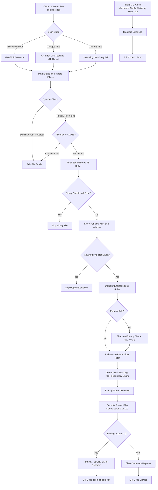

# GitLeak Radar

[](https://www.npmjs.com/package/gitleak-radar)
[](https://www.npmjs.com/package/gitleak-radar)

[](https://github.com/gecekusu1979/gitleak-radar/actions)
[](https://github.com/gecekusu1979/gitleak-radar)
[]()
[](LICENSE)
[](https://www.typescriptlang.org/)
[](https://nodejs.org/)
[-success.svg)](#security-model)

> **Static credential scanner and automated Git pre-commit hook designed to detect exposed API keys, access tokens, private keys, and database connection strings before code is committed or pushed.**

GitLeak Radar runs locally across your codebase, directly against the staged Git index, or across Git commit history. It combines regex-based pattern matching, keyword pre-filtering, Shannon entropy checks for generic API keys, OASIS SARIF v2.1.0 reporting, and fail-closed workflow gates while preserving masked findings and a 0-100 repository security score.

GitLeak Radar is designed as a local-first SAST tool for detecting API keys, access tokens, private keys, database credentials, and other sensitive values before they enter commits or CI/CD workflows.

---

## Key Features

- **Shannon Entropy Engine:** Generic API key candidates are validated with Shannon entropy and a default threshold of $H(X) \ge 3.0$ to reduce low-complexity false positives.
- **Streaming Git History Scanning:** `--history` processes added diff lines incrementally instead of loading the complete commit history into memory, while retaining commit hash, author, and date metadata for findings.
- **History Diff Hardening:** History scans force `diff.external=` and `--no-ext-diff`, and terminate Git path arguments with `--` to reduce external diff and argument-injection risks.
- **SARIF v2.1.0 Reporting:** `--sarif [file]` emits OASIS SARIF 2.1.0 output for GitHub Code Scanning and other compatible CI tooling.
- **True Git Index Isolation:** In `--staged` mode, files are evaluated directly from Git's object database (`git show :<path>`). Modifying or clearing a secret from the working directory after staging cannot bypass detection.
- **Fail-Closed Pre-Commit Security:** Hook scripts enforce a fail-closed posture (`exit 2`). If `gitleak-radar` or `npx` cannot be executed, commits are blocked rather than silently skipped.
- **Monorepo & Nested Config Traversal:** `.gitleak-radar.json` configurations are resolved through upward filesystem traversal from the target path.
- **High-Performance Keyword Pre-Filtering:** Fast substring pre-screening via `rule.keywords` eliminates unnecessary regex evaluations on unrelated lines.
- **Leak-Safe Finding Contract:** Plaintext secrets are excluded from the core `Finding` data model. Terminal and JSON reporters exclusively expose masked fingerprints (e.g., `AKIA********1234`).
- **Self-Security Hardening:** Hardened against ReDoS on minified bundles (`MAX_LINE_LENGTH = 8192`), symlink traversal exploits (`fs.lstat` and Git mode `120000`), and Git CLI argument injection (`--` option delimiters).
- **Default Test Directory Coverage:** `tests/` and `test/` directories are scanned by default to prevent hardcoded credentials from leaking through test fixtures or mock environments.
- **Unquoted `.env` Secret Detection:** Robust capture rules support both quoted and unquoted environment variable definitions (e.g., `API_KEY=sk_live_...`), preserving comments and boundary safety.
- **Path-Aware Placeholder Filtering:** Distinct placeholder logic ensures real credentials containing words like `test` or `dummy` (e.g., `sk_test_...`) in production code are never filtered out, while documentation and fixtures retain test-token bypasses.
- **Deduplicated Security Scoring:** Repeated secrets within the same file apply a single rule penalty, preventing skewed zero-scores across large codebases while preserving accurate finding counts.
- **Staged Git Scanning:** Scans changes directly in the Git staging index via `git diff --cached`, correctly resolving files across repository root and nested working directories.
- **Pre-commit Automation with Severity Control:** Hook installer (`gitleak-radar install-hook -s <level>`) configures automated commit validation with explicit POSIX executable permissions and customizable threshold gating.
- **Large File Protection:** Skips files larger than 10MB (`MAX_FILE_SIZE_BYTES`) before buffering into memory to prevent process exhaustion.
- **Binary & Ignore Handling:** Automatically bypasses null-byte binary buffers, `.git`, `node_modules`, `dist`, `build`, and lockfiles. User files named `rules.ts` or `detector.ts` outside internal engine directories are fully scanned.
- **Strict Config Validation:** `.gitleak-radar.json` configurations are verified with Zod for known rule IDs and checked against malformed glob syntax.
- **Deterministic Exit Codes:** Strict exit code conventions (`0`, `1`, `2`) for robust pipeline and shell automation.

## Advanced Security Features

### Shannon Entropy Engine

For entropy-aware rules, GitLeak Radar calculates the character distribution of each candidate token:

$$H(X) = -\sum_{i=1}^{n} P(x_i) \log_2 P(x_i)$$

Candidates below the configured threshold are discarded as low-complexity values. The built-in `generic-api-key` rule uses a minimum entropy threshold of $H(X) \ge 3.0$.

### Streaming Git History

`gitleak-radar scan --history` reads Git diff output incrementally, scanning added lines while retaining commit hash, author, and ISO date metadata. History scans disable external diff commands with `-c diff.external=` and `--no-ext-diff`, and use `--` to isolate Git path arguments.

### SARIF Integration

`gitleak-radar scan --sarif report.sarif` writes SARIF v2.1.0 output with rule metadata, source locations, severity levels, masked messages, and commit fingerprints where available. Omitting the file path writes the report to standard output for CI pipelines.

## Performance

The scanner is optimized for local and CI use through keyword pre-filtering, bounded 8 KB line processing, file-size guards, and streaming history parsing. Run `pnpm test` to measure the current test-suite duration in your environment.

## Architecture

The following diagram illustrates the execution path from CLI entry to exit code assignment:



## Quick Start

### Installation

Install globally using `npm` or `pnpm`:

```bash
npm install -g gitleak-radar
# or
pnpm add -g gitleak-radar
```

Alternatively, invoke directly with `npx`:

```bash
npx gitleak-radar scan .
```

### Basic Scans

Initialize default configuration:

```bash
# Initialize default configuration
npx gitleak-radar init
```

Scan the entire current directory:

```bash
gitleak-radar scan .
```

Scan only files currently in the Git staging area:

```bash
gitleak-radar scan --staged
```

Scan added lines across the full Git commit history:

```bash
gitleak-radar scan --history
```

Generate a SARIF v2.1.0 report for CI or GitHub Code Scanning:

```bash
gitleak-radar scan --sarif report.sarif
```

## Pre-commit Hook Integration

Install GitLeak Radar into your local `.git/hooks/pre-commit` file:

```bash
gitleak-radar install-hook
```

The installer verifies whether the hook script is already registered before writing, making the setup safe to re-run.

To configure a minimum severity threshold for commits:

```bash
gitleak-radar install-hook -s high
```

### Fail-Closed Behavior

The pre-commit hook runs in **fail-closed mode**: if `gitleak-radar` or `npx` is not available in the execution environment, commits are blocked with exit code `2` to prevent uninspected code from entering version control. Commits can be bypassed explicitly when needed using `git commit --no-verify`.

```bash
git add .
git commit -m "feat: add payment gateway credentials"

# GitLeak Radar: Scanning staged files...
# Commit blocked: Sensitive credentials detected in staged changes.
# Please unstage or mask secrets before committing.
# Exit code 1.
```

## CLI Reference

```text
Usage: gitleak-radar [options] [command]

GitLeak Radar - Fast, local source-code secret scanner CLI.

Options:
  -V, --version                      Output the current version
  -h, --help                         Display help for command

Commands:
  scan [options] [path]              Scan files or staged Git changes for secrets
  rules                              List all built-in credential detection rules
  init [path]                        Initialize a default .gitleak-radar.json configuration file
  install-hook [options] [path]      Install GitLeak Radar as a Git pre-commit hook
```

### Scan Command Options

| Option | Description | Default |
| --- | --- | --- |
| `-r, --rules <file>` | Path to external custom rules JSON file | - |

```bash
# Scan with specific severity threshold (low, medium, high, critical)
gitleak-radar scan . --severity high

# Emit raw, automation-ready JSON output
gitleak-radar scan . --json

# Enable verbose logging to see scanned, ignored, and binary files
gitleak-radar scan . --verbose

# Ignore specific directories during a filesystem scan
gitleak-radar scan . --ignore "fixtures" "temp-data"

# Scan full Git history using a streaming diff parser
gitleak-radar scan . --history

# Write SARIF v2.1.0 output to a file (omit the path to print to stdout)
gitleak-radar scan . --sarif report.sarif

# Inspect detailed command help
gitleak-radar scan --help
```

## Detection Rules

All rules are defined in `src/detectors/rules.ts` and can be inspected with `gitleak-radar rules`:

| Rule ID | Severity | Target Credential Type | Description / Matching Pattern |
| --- | --- | --- | --- |
| `aws-access-key` | `CRITICAL` | AWS Access Key ID | 20-character identifier starting with `AKIA` |
| `aws-secret-key` | `CRITICAL` | AWS Secret Access Key | 40-character secret patterns bound to AWS key variables |
| `github-pat` | `CRITICAL` | GitHub Personal Access Token | Modern prefixed tokens (`ghp_`, `gho_`, `ghu_`, `ghs_`, `ghr_`, `github_pat_`) |
| `gitlab-pat` | `CRITICAL` | GitLab Personal Access Token | GitLab personal and project tokens (`glpat-...`) |
| `stripe-api-key` | `CRITICAL` | Stripe API Key | Live standard and restricted keys (`sk_live_`, `rk_live_`) |
| `openai-api-key` | `CRITICAL` | OpenAI API Key | Legacy and project-scoped keys (`sk-`, `sk-proj-`) |
| `slack-webhook` | `HIGH` | Slack Incoming Webhook | Slack webhook URLs (`hooks.slack.com/services/...`) |
| `azure-storage-key` | `CRITICAL` | Azure Storage Account Key | `AccountKey` and `SharedAccessKey` values |
| `jwt` | `HIGH` | JSON Web Token | Three-segment Base64URL-encoded tokens (`ey...`) |
| `db-connection-string` | `HIGH` | Database Connection URI | Embedded credentials in MongoDB, PostgreSQL, and MySQL connection strings |
| `private-key` | `CRITICAL` | Private Key Block | PEM private key boundaries (`-----BEGIN ... PRIVATE KEY-----`) |
| `slack-token` | `HIGH` | Slack Access Token | Slack user, bot, and app tokens (`xox[baprs]-...`) |
| `google-api-key` | `HIGH` | Google API Key | Google Cloud and service keys starting with `AIza` |
| `generic-api-key` | `MEDIUM` | Generic API Secret | Quoted or unquoted assignments validated with $H(X) \ge 3.0$ entropy |
| `generic-bearer-token` | `HIGH` | Generic Bearer Token | Bearer authorization tokens (minimum 20 characters) |
| `generic-password` | `MEDIUM` | Generic Password Assignment | Hardcoded passwords in source code or `.env` configurations |

## Configuration (`.gitleak-radar.json`)

To configure path exclusions or toggle specific rules, add an optional `.gitleak-radar.json` file to your project:

```json
{
  "ignore": [
    "docs/**"
  ],
  "rules": {
    "generic-api-key": false
  }
}
```

### Custom Rules

You can define proprietary corporate rules in `.gitleak-radar.json`:

```json
{
  "ignore": ["tests", "dist"],
  "customRules": [
    {
      "id": "corp-api-key",
      "name": "Corporate API Key",
      "description": "Detects internal secret keys",
      "severity": "high",
      "regex": "ACME_[A-Za-z0-9]{32}",
      "keywords": ["ACME_"],
      "minEntropy": 3.2
    }
  ]
}
```

Or pass external custom rules on the fly via CLI:

```bash
npx gitleak-radar scan --rules ./company-rules.json
```

### Monorepo & Upward Traversal

When scanning subdirectories or packages (for example, `gitleak-radar scan packages/backend`), the scanner traverses upward from the target directory until it locates `.gitleak-radar.json`.

### Schema Rules & Error Handling

- **`ignore`**: Array of glob path strings to skip during directory scans. Unbalanced brackets or braces (e.g. `[unclosed/` or `foo}`) trigger an explicit configuration error.
- **`rules`**: Key-value map of known rule IDs to booleans. Invalid rule IDs fail validation immediately with informative messages displaying all valid IDs.
- **Validation**: Configurations are strictly validated using a Zod schema. If the JSON is malformed or invalid, GitLeak Radar aborts execution with exit code `2`.

## Security Model

- **True Index Isolation:** Staged file scans evaluate the Git index blob rather than the working tree, closing bypass windows where staged secrets are wiped from disk before a commit.
- **Symlink Traversal Protection:** Symlinks are rejected via `fs.lstat` and Git object mode `120000`, preventing arbitrary file disclosure of external host targets.
- **ReDoS Defense:** Scanned lines are bounded by `MAX_LINE_LENGTH = 8192`, preventing catastrophic backtracking when inspecting massive single-line minified files.
- **Git Argument Injection Delimiters:** Git CLI invocations isolate target paths behind explicit `--` option terminators.
- **Safe Process Invocation:** All Git commands run through `child_process.execFile` with isolated argument vectors. Shell string concatenation is avoided.
- **Fingerprinting Only:** The `Finding` model omits raw secret values. Reporters receive masked strings instead of plaintext credentials.
- **Zero Network Interaction:** GitLeak Radar contains zero network dependencies, telemetry emitters, or cloud connections. Scanning logic executes entirely on the local host.

## Exit Codes

GitLeak Radar follows POSIX exit conventions for standard shell and CI/CD integration:

| Exit Code | Status | Description |
| --- | --- | --- |
| `0` | Clean | Scan completed successfully with zero findings above the selected severity. |
| `1` | Findings Detected | One or more active secrets matching the criteria were detected. |
| `2` | Execution Error / Fail-Closed | Scan aborted due to missing tools, invalid arguments, malformed JSON configuration, or runtime failures. |

## Repository Structure

```text
src/
|-- cli/              # Commander CLI entrypoint, argument parsing, error routing
|-- config/           # Zod schema validation and upward .gitleak-radar.json loader
|-- detectors/        # Regex pattern matching rules, keyword pre-filtering, and detector logic
|-- git/              # Git root resolution, index blob reader, staged diff, and history scanning
|-- hooks/            # Idempotent fail-closed Git pre-commit hook installer
|-- reporters/        # Chalk terminal, JSON, and SARIF report formatters
|-- scanner/          # File filtering, symlink guards, 10MB size guard, and orchestrator pipeline
|-- scoring/          # 0-100 normalized security score algorithm
`-- types/            # TypeScript interfaces (Finding, ScanResult, ScanOptions)

tests/
|-- cli/              # CLI integration and argument tests
|-- config/           # Zod validation and upward traversal tests
|-- detectors/        # Pattern detection, pre-filter, and false-positive filter tests
|-- git/              # Git root resolution, staged diff, index isolation, and history tests
|-- hooks/            # Pre-commit hook installer and fail-closed posture tests
|-- reporters/        # SARIF v2.1.0 reporter tests
|-- scanner/          # File exclusion, binary, and 10MB limit tests
|-- scoring/          # Security score calculation tests
`-- security/         # ReDoS, path traversal, and symlink hardening tests
```

## Development & Testing

### Requirements

- Node.js >= 18.0.0
- pnpm >= 9.0.0

### Commands

```bash
# Install local dependencies
pnpm install

# Run TypeScript typechecks
pnpm typecheck

# Run the Vitest test suite (70 automated tests)
pnpm test

# Build the production bundle
pnpm build

# Test package artifacts without publishing
npm pack --dry-run
```

## Why GitLeak Radar?

- **Local-First Architecture:** Keeps credential evaluation directly inside your machine or ephemeral CI worker.
- **Native Git Integration:** Inspects Git index buffers rather than scanning the entire filesystem on every commit.
- **Commit Gatekeeper:** Blocks secrets before they enter your commit history, avoiding complex Git history rewrites.
- **Type-Safe Core:** Built with strict TypeScript checks and validated configuration schemas.

## Roadmap

### Completed in v1.2.0

- [x] Custom user-defined regex and entropy rules via `.gitleak-radar.json` and `--rules`
- [x] CLI configuration bootstrapping (`gitleak-radar init`)
- [x] History streaming memory guard (10MB per-file boundary)

### Planned for Upcoming Releases (v1.3.0+)

- [ ] Configurable maximum file size limit via CLI (`--max-file-size`) and configuration
- [ ] Rule explainer command (`gitleak-radar explain <rule-id>`)
- [ ] Automated benchmark suite comparing throughput and false-positive rates against Gitleaks and TruffleHog
- [ ] GitLab CI and Bitbucket Pipelines template recipes

## License

This project is licensed under the **GNU General Public License v3.0** (GPL-3.0-or-later). See the [LICENSE](LICENSE) file for the full license text.
